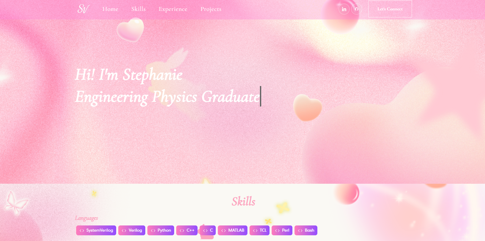

# 💻 Stephanie Vo — Portfolio Website

Version 1 of personal portfolio website.

🔗 **Live Site**: [stephanie-vo.github.io/website](https://stephanie-vo.github.io/website)



---

## 🛠️ Technologies Used

### ⚙️ Frameworks & Libraries
- **React.js** – UI framework for building component-based SPA
- **React Bootstrap** – Responsive layout and styled components
- **Bootstrap Icons** – Modern icon set used throughout the UI
- **Animate.css** – Animations on scroll and interaction
- **React Multi Carousel** – For skills and projects carousels
- **React On Screen** – Visibility-based animations

### 🧰 Build & Deployment
- **Create React App (CRA)** – Frontend boilerplate
- **GH Pages** – Deployed via `gh-pages` to GitHub Pages

---

## 📁 Getting Started Locally

```bash
git clone https://github.com/stephanie-vo/website.git
cd website
npm install
npm start
